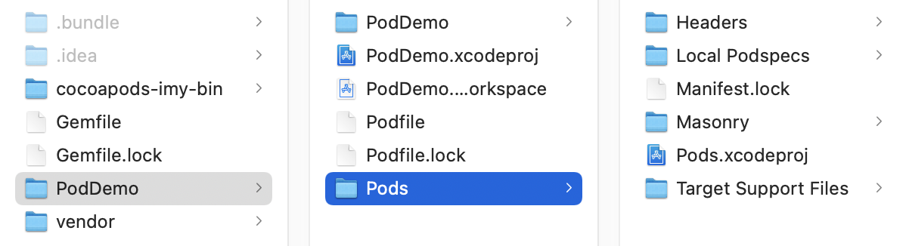
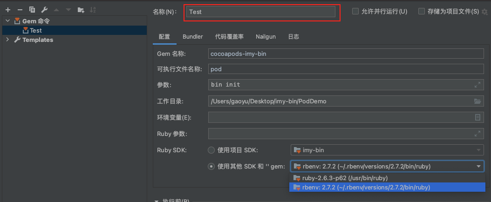
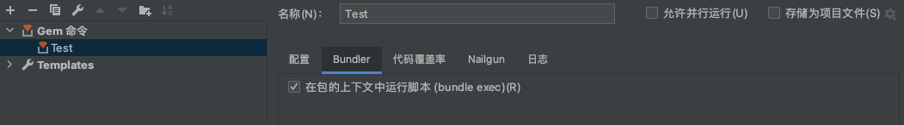
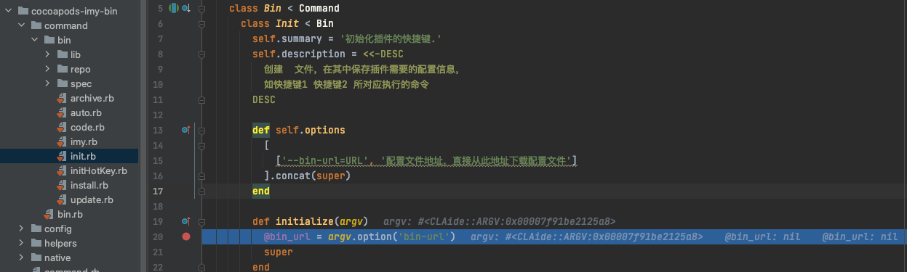

## 前言

稍微调研下优化编译时长, 除硬件设备和Xcode一些编译配置项外, 大体有以下👇几种方案:

<!-- more -->


## 编译速度优化

### 缓存编译产物 

#### CCache

> 把编译的中间产物缓存起来的工具, [Using ccache for Fun and Profit | Inside PSPDFKit](http://link.zhihu.com/?target=https%3A//pspdfkit.com/blog/2015/ccache-for-fun-and-profit/), 使用简单

缺点: 不支持 Clang Modules、PCH, Swift

#### Buck & Bazel

> [Buck](https://zhuanlan.zhihu.com/p/buckbuild.com) 是Facebook 开源, [Bazel](http://link.zhihu.com/?target=https%3A//bazel.build/)是Google 开源, 它们能智能的增量编译, 进而提高构建速度, 之前用在安卓, 已经适配了iOS.

优点: 
1. 缓存了编译结果，通过持续监视项目目录的文件变化，每次编译时只编译有改动的文件。 
2. 通过一台缓存文件服务器来保存大家的编译结果，只要团队里其中一人编译过的文件，其他人就不用再编译了，直接下载就行。

缺点: 
1. 因为由[Buck](https://zhuanlan.zhihu.com/p/buckbuild.com)接管了项目编译的过程, 所以项目进行大幅度调整

> 这个方案不错, 可以进行参考, 听说我们的安卓团队小伙伴就是通过脚本来进行监听项目文件变化, 来进行增量编译, 后续可以去取经~


### 分布式编译

> 把编译任务分派到内网的多台服务器上，服务器编译完成后把编译产物传回来。比较出名的是`distcc`。

这种方案没有深入调研。


### 组件二进制化

#### 平滑组件库改造

> 通过引入变量的方式, 在podspec文件中进行判断是使用源码还是二进制的source

缺点: 需要一个一个库的改造, 且podspec的库版本是使用json格式来进行缓存的, 引入变量不知是否会有问题

#### Carthage

> Carthage可以将一部分不常变的库打包成framework，可以比较方便地调试源码, 但是对于项目的改动较大

#### cocoapods-packager

> 仅需要通过podspec文件, 在lint通过后就可以将pod打包成Static Library。但是有很长时间没有更新了。

#### cocoapods-binary

>  原理是通过 CocoaPods 提供的 pre_install hook 在 pod install 的 prepare 阶段拦截到当前的 pod install context，进而 fork 出一份独立的 installer 以完成将预编译源码 clone 至 Pod/_Prebuild 目录下。

使用很简单, 试用了一下: 

会拖慢pod install速度, 源码切换调试后, 缓存会被清理, 需要重新编译。这个对于项目第一次编译来说没有任何作用,  而打包等场景更多的是优化第一次的编译速度

#### cocoapods-bin & cocoapods-imy-bin

>  `cocoapods-imy-bin`算是`cocoapods-bin`的强化版, 增添了很多功能, 总体适用下来侵入性低, 功能比较全。

#### 总结

> 如果选用二进制化方案, 可以预见性的一些问题有一下几点: 

1. 单私有源, 没有服务端缓存的不可取, 对于第一次编译没有效果

2. 我们有多种方式生成静态库,  在使用服务端缓存时, 一定不要使用Git来管理二进制文件, 会拖慢Git拉取的速度, 毕竟Git的缓存机制来说是不能管理大文件的, 推荐静态服务器。


### 完善头文件的搜索机制

> 1: cocoapods-hmap-prebuilt 是美团一款 cocoapods 插件，以 [Header Map 技术](https://clang.llvm.org/doxygen/classclang_1_1HeaderMap.html) 为基础，提升代码的编译速度，完善头文件的搜索机制。
>
> 2: Clang Module

未尝试, 美团文章中提供的cocoapods-hmap-prebuilt的source无法访问, 下载不了gem

不过原理已经告诉了我们, 也是一种努力的方向


## Ruby工具链

目前流行的 Ruby 环境管理工具有 RVM 和 rbenv。我们使用那一种都可以, RVM较重, rbenv轻量级。

但是这两个工具是不兼容的, 我们只能选择其一, 即在搜索ruby的sdk时, 只有一个是可见的。

两个的安装和使用这里不在赘述, 下面为官方文档: 

[RVM实用指南](https://ruby-china.org/wiki/rvm-guide)

[rbenv实用指南](https://ruby-china.org/wiki/rvm-guide)


## 编写cocoapods插件

[cocoapods-plugins文档](https://github.com/CocoaPods/cocoapods-plugins)

```powershell
// 安装
gem install cocoapods-plugins
// 创建
pod plugins create NAME [TEMPLATE_URL]
// eg:
pod plugins create author
```

如何使用: 

```powershell
// 查看安装过的插件
pod plugins installed
// 查看已知的插件
pod plugins list
// 查找插件
pod plugins search QUERY
// 发布自己的插件
pod plugins publish
```

目录结构:

```powershell
.
├── Gemfile
├── LICENSE.txt
├── README.md
├── Rakefile
├── cocoapods-author.gemspec
├── lib
│   ├── cocoapods-author
│   │   ├── command
│   │   │   └── author.rb
│   │   ├── command.rb
│   │   └── gem_version.rb
│   ├── cocoapods-author.rb
│   └── cocoapods_plugin.rb
└── spec
    ├── command
    │   └── author_spec.rb
    └── spec_helper.rb
```

解析author.rb的内容

```ruby
module Pod
  class Command
    class Author < Command
      # pod plugins list 时，展示的概要信息
      self.summary = 'Short description of cocoapods-author.'

      # --help / 命令错误时展示的描述信息
      self.description = <<-DESC
        Longer description of cocoapods-author.
      DESC

      # --help / 命令错误时展示的参数信息
      self.arguments = 'NAME'

      def initialize(argv)
        @name = argv.shift_argument
        super
      end

      # 校验方法（查看文件是否存在等）
      def validate!
        super
        help! 'A Pod name is required.' unless @name
      end

      # 运行命令
      def run
        UI.puts "Add your implementation for the cocoapods-author plugin in #{__FILE__}"
      end
    end
  end
end
```


## RubyMine调试cocoapods插件

**RubyMine**是一个Ruby的IDE开发工具, 当然我们也可以使用**VSCode**来进行调试和开发

RubyMine是一个可以免费使用30天的收费软件,  这里我使用的是破解版本


### 准备源码

我们可以调试任意的cocoapods插件, 我们以`cocoapods-imy-bin`为例, ``cocoapods-imy-bin`是一款可以使源码库转换为二进制的插件, 是`cocoapods-bin`的强化版本

创建目录`imy-bin`:

```powershell
imy-bin
├── Gemfile #bundle的依赖文件
├── cocoapods-imy-bin #插件的源码
├── PodDemo #这个就是一个随便用xcode建立的iOS的使用podfile的demo工程
```

其中`Gemfile`中的内容为: 

```ruby
#国内的源比较快
#source 'https://rubygems.org'
source 'https://gems.ruby-china.com'

gem 'cocoapods-imy-bin' , :path => "./cocoapods-imy-bin"

#下面的代码不用写,因为RubyMine在调试时,会自动安装这些gem, 如果是vscode调试的话, 需要安装gem
group :debug do
    gem 'ruby-debug-ide'
    gem 'debase'
end
```


### 安装依赖

在当前目录下建立`./bundle/config`文件, `config`内容如下: 

```powershell
BUNDLE_PATH: "vendor/bundle"
```

执行 bundle install, 将会把Gemfile文件中所申明的依赖都安装到vendor/bundle目录下

因为我们是调试某个gem库, 为了不影响我们已经安装的, 安装依赖的时候, 最好是安装到当前文件夹下的执行目录中去, bundle会检查, 如果配置了`config`文件的话, 是可以在配置文件中声明安装的目录的。

而且不指定安装到当前目录, 会写入到ruby环境所在文件, 我们系统有可能没有写入权限, 进而报错。

创建文件完成后, 我们在在前目录执行`bundle install`, 将依赖安装进`vendor/bundle`中

此时的目录结构为: 




### RubyMine设置

RubyMine打开`imy-bin`文件夹, 设置`Edit Configurations`





### 调试

我们找到`cocoapods-imy-bin`插件的中命令`pod bin init`的函数入口, 打断点。

点击小爬虫, 进行调试: 




至此, 我们就可以通过调试, 然后看看`cocoapods-imy-bin`作者的实现思路以及每一个命令的都做了哪些事情~


## 参考

[rubymine调试cocoapods插件](https://www.jianshu.com/p/185b1eb5687b)

[编写自己的 CocoaPods 插件](https://triplecc.github.io/2017/11/08/2017-11-08-chuang-jian-cocoapodscha-jian/)

